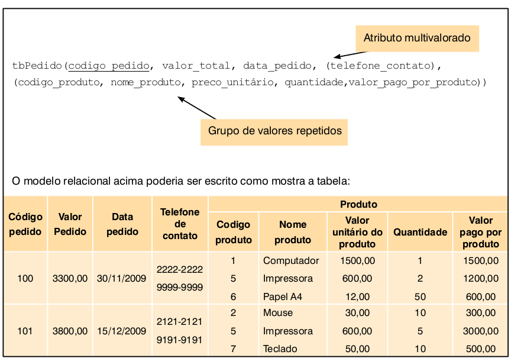
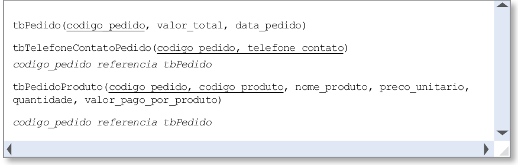
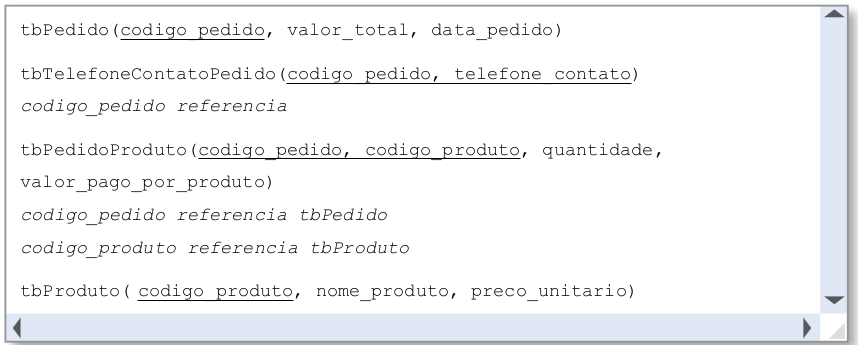
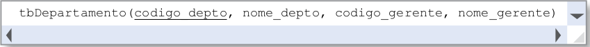
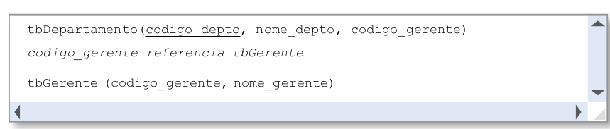

# Normalização

O processo de normalização geralmente é aplicado quando temos uma base de dados que foi criada antes da existência de um banco relacional ou foi desenvolvida sem considerar a existência de uma banco de dados relacional.

Na maioria dos casos, esses sistemas são antigos e seus arquivos possuem muitas informações **redundantes** e **inconsistentes**. Além disso, normalmente não existe nenhum documento que especifique o modelo de dados, o que torna muito difícil a manutenção desses sistemas ou as migrações para um banco de dados relacional.

> ***Vale ressaltar que o modelo conceitual da base de dados agiliza bastante o processo de manutenção, porque permite que pessoas que não participaram do desenvolvimento do projeto possam atendê-lo mais rapidamente*.**

Ás vezes, também encontramos sistemas não muito antigos e que, no entanto, foram implementados usando **uma única tabela**. Nesses casos, as informações estarão **repetidas**, haverá muitos valores nulos na base e será muito difícil executar consultas que retornem valores consistentes com o esperado.

Para resolver ou minimizar tais problemas apresentados, pode-se fazer o que chamamos de engenharia reversa do projeto, utilizando para isso o **processo de normalização**. A engenharia reversa do projeto consiste em, **a partir dos dados armazenados, obter um modelo conceitual (ou relacional) da base de dados e eliminar as redundâncias**.

Também podemos utilizar o **processo de normalização** para conferir se o nosso modelo de dados está normalizado e, caso não esteja, pode-se normalizá-lo antes da implementação da base de dados no SGBD.

O **processo de normalização** consiste em um **conjunto de regras**, denominadas **formas normais**. A literatura apresenta 6 formas normais: 1FN, 2FN, 3FN, 4FN, 5FN e de Boyce/Codd. Alguns autores tratam a forma normal de Boyce/Codd como sendo um caso específico da 3FN.

No entanto, para a maioria das bases de dados, a aplicação até a 3FN é suficiente. Sendo assim, só iremos abordar as três primeiras formas normais.

A tabela **tbPedido** será utilizada para demonstrar o processo de normalização.

## Primeira Forma Normal (1FN)

> **Toda tabela está na 1FN se os seus atributos forem atômicos.** Isso significa que não serão permitidos atributos compostos, multivalorados ou grupos repetidos de dados (também conhecidos como tabelas aninhadas).

Os grupos repetidos de dados ocorrem quando uma tabela aparece dentro de outra tabela. Por exemplo, na tabela **tbPedido** da figura, temos uma única tabela que armazena os dados pedidos e de produtos. Assim, os dados referentes ao produto pertencem a uma tabela que está dentro da tabela de pedido.

É possível perceber que a tabela **tbPedido** não está na 1FN porque além de grupos repetidos ela também tem um atributo multivalorado.

**Para deixar uma tabela na 1FN, é necessário fazer o seguinte:**

* Os **atributos compostos** devem ser decompostos e armazenados como atributos simples
* Para cada **atributo multivalorado** será criada **uma tabela** que irá conter o **atributo multivalorado mais a chave primária da tabela inicial**, que passa como **chave estrangeira**. A **chave primária** da **nova tabela** será **composta**.
* Para cada grupo repetido será criada uma tabela que irá conter os atributos do grupo repetido mais a chave primária da tabela inicial, que passa como chave estrangeira e irá ajudar a compor a chave primária

A figura abaixo mostra como ficaria o modelo original (não normalizado) após aplicarmos a 1FN.

## Segunda Forma Normal (2FN)

A 2FN só é aplicável para tabelas que possuem uma chave primária composta e que, além disso, tenham outros atributos que não façam parte desta chave primária.

> ***Uma tabela está na 2FN se estiver na 1FN e todo atributo que não compõe a chave primária deve ter dependência funcional total em relação à chave primária*.**

No modelo relacional, a **dependência funcional** entre dois atributos, A e B, ocorre quando, em todas as linhas da tabela, para cada valor de A irá aparecer sempre o mesmo valor de B. Por exemplo, na tabela **tbPedidos** sempre que aparecer o código de produto  "5" teremos como nome do produto "Impressora". Assim, o nome do produto dependente **funcionalmente** do código do produto.

Para que a **dependência funcional** seja total, o atributo deve depender de toda a chave primária composta. Por exemplo, na tabela **tbPedidoProduto** o atributo **quantidade** representa a quantidade de um produto que foi solicitada em um pedido. Assim,o atributo **quantidade** depende tanto do **codigo_produto** quando do **codigo_pedido**, caracterizando uma **dependência funcional total**. O atributo **nome_produto**, por outro lado, tem uma **dependência funcional parcial**, porque depende apenas de parte da chave primária, ou seja, depende apenas do **codigo_produto**.

Para deixarmos o modelo na 2FN devemos:

* Repetir as tabelas que tenham chave primária simples, pois já estão na 2FN.
* Repetir as tabelas que tenham chave primária composta, mas que não tenham nenhum outro atributo além dos que compõem a chave primária.
* Para cada tabela que tiver chave primária composta e pelo menos um atributo que não faz parte da chave, deve-se verificar se cada um dos atributos não chave têm **dependência funcional total**. Caso a dependência não seja total, deve-se criar uma nova tabela com o atributo que depende parcialmente, mais o atributo do que ele depende (que será a chave primária na nova tabela e será chave estrangeira na tabela inicial).

Como ficaria o modelo após aplicarmos a 2FN.

## Terceira Forma Normal (3FN)

Uma tabela está na 3FN se estiver na 2FN e ela não possuir dependência transitivas.

> ***Dependência Transitiva ocorre quando existe um atributo que não é chave e nem faz parte da chave, mas que identifica um que depende de outro atributo não-chave***

Como no modelo do exemplo não existem dependências transitivas, ele já está na 3FN. No entanto, para entermos melhor dependências transitivas, vamos supor a situação da figura abaixo.

A tabela da figura está na 1FN porque todos os seus atributos são atômicos e está na 2FN porque não tem chave primária composta. No entanto, temos uma dependência transitiva que ocorre com o atributo **nome_gerente** que depende do atributo **codigo_gerente** que não é chave e nem faz parte da chave primária.

Para eliminar dependências transitivas, deve-se criar uma nova tabela que irá conter o atributo que depende (ex: **nome_gerente**) mais o atributo do qual ele é dependente (ex: **codigo_gerente**). A figura abaixo mostra como ficaria o modelo.

É interessante sempre aplicarmos as três formas normais ao nosso modelo relacional antes de implementar esse modelo no SGBD.

**Material Complementar:**

* [Slides Complementares](https://github.com/IgorAvilaPereira/bd2022_1sem/raw/main/11_normalizacao_material_complementar.pdf)

* https://github.com/IgorAvilaPereira/banco-de-dados/blob/master/normalizacao/aula_08-formas_normais_1FN-2FN.pdf

* https://rogeraoaraujo.com.br/2020/05/11/banco-de-dados-normalizacao/

* https://sites.google.com/site/uniplibancodedados1/aulas/normalizacao 

