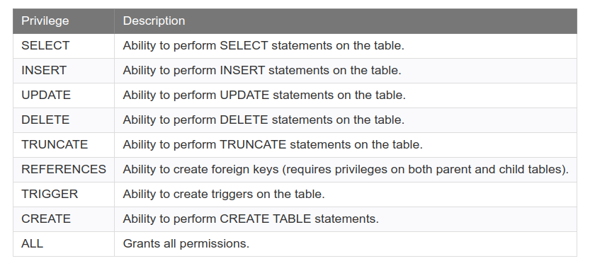

# DCL

## Criar usuário
```sql
1) CREATE ROLE name;
CREATE ROLE name [ [ WITH ] option [ ... ] ]
      SUPERUSER | NOSUPERUSER
    | CREATEDB | NOCREATEDB
    | CREATEROLE | NOCREATEROLE
    | INHERIT | NOINHERIT
    | LOGIN | NOLOGIN
    | REPLICATION | NOREPLICATION
    | BYPASSRLS | NOBYPASSRLS
    | CONNECTION LIMIT connlimit
    | [ ENCRYPTED ] PASSWORD 'password' | PASSWORD NULL
    | VALID UNTIL 'timestamp'
    | IN ROLE role_name [, ...]
    | IN GROUP role_name [, ...]
    | ROLE role_name [, ...]
    | ADMIN role_name [, ...]
    | USER role_name [, ...]
    | SYSID uid
2) CREATE USER name [ [ WITH ] option [ ... ] ]
      SUPERUSER | NOSUPERUSER
    | CREATEDB | NOCREATEDB
    | CREATEROLE | NOCREATEROLE
    | INHERIT | NOINHERIT
    | LOGIN | NOLOGIN
    | REPLICATION | NOREPLICATION
    | BYPASSRLS | NOBYPASSRLS
    | CONNECTION LIMIT connlimit
    | [ ENCRYPTED ] PASSWORD 'password' | PASSWORD NULL
    | VALID UNTIL 'timestamp'
    | IN ROLE role_name [, ...]
    | IN GROUP role_name [, ...]
    | ROLE role_name [, ...]
    | ADMIN role_name [, ...]
    | USER role_name [, ...]
    | SYSID uid
```

## Remover um Usuário
```sql
1) DROP ROLE name;
2) DROP USER name;
```

## Renomear um Usuário

```sql
ALTER USER <nome_antigo_usuario>
  RENAME TO <nome_novo_usuario>;
```

## Listar Usuários
```sql
SELECT rolname FROM pg_roles;
```

## Criar Usuários com Privilégios

### Usuário com Login

```sql
1) CREATE ROLE name LOGIN;
2) CREATE USER name;
```

### Usuário Superuser

```sql
1) CREATE ROLE name SUPERUSER
2) CREATE USER name SUPERUSER
```

### Usuário com Capacidade de Criar BD's

```sql
CREATE ROLE name CREATEDB
```

### Usuário que Pode Criar/Alterar outros Usuários/papéis 

```sql
CREATE ROLE name CREATEROLE
```

### Usuário com Senha

```sql
CREATE ROLE name PASSWORD 'string'.
```

## Logando com um Usuário

```bash
psql -h localhost -U <usuario> <banco>;
```

### Alterar Privilégios 

```sql
ALTER ROLE
-- ex:
ALTER ROLE <usuario> SET <privilegio> TO OFF | ON;
```

### Remover Algum Privilégio Específico

```sql
use ALTER ROLE rolename RESET varname.

```
<!-- 
## dar acesso a um schema para um determinado usuário

```sql
CREATE SCHEMA IF NOT EXISTS test AUTHORIZATION joe;
``` 
-->

<!-- ### um usuário pode fazer qualquer coisa em uma determinada tabela

```sql
GRANT ALL ON <tabela> TO <username>;
``` 
-->

### Atribuindo um Privilégio Para um Usuário

```sql
GRANT <privilegio> ON <object> TO <username>;
-- ex. o usuário techonthenet pode fazer select, insert, update e delete na tabela products
GRANT SELECT, INSERT, UPDATE, DELETE ON products TO techonthenet;

-- ex: dando todos os privilégios para usuário teste2 na tabela pessoa
GRANT ALL ON pessoa_id_seq TO teste2;
GRANT ALL ON pessoa TO teste2;

-- ex. o usuário teste3 pode fazeer apenas  consultas  (SELECT) na tabela pessoa
GRANT SELECT ON pessoa TO teste3;
```

## Revogando um privilégio de um determinado usuário

```sql
REVOKE <privileges> ON <object> FROM <user>;
-- ex o usuário techonthenet não pode fazer nada na tabela products:
REVOKE ALL ON products FROM techonthenet;
-- ex: o usuário techonthenet não pode fazer delete e update na tabela products
REVOKE DELETE, UPDATE ON products FROM techonthenet;
```



<!-- ## Permitindo que um usuário faça tudo em um banco

```sql
grant all privileges on database <banco> to <usuario>;
``` 
-->

## Permitindo que um Usuário faça Tudo em um Esquema

```sql
GRANT ALL PRIVILEGES ON ALL TABLES IN SCHEMA <schema_name> TO <username>;
GRANT ALL PRIVILEGES ON ALL SEQUENCES IN SCHEMA <schema_name> TO <username>;
```

## Revogando que um Usuário Faça Tudo em um Esquema

```sql
REVOKE ALL PRIVILEGES ON ALL TABLES IN SCHEMA <schema_name> TO <username>;
REVOKE ALL PRIVILEGES ON ALL SEQUENCES IN SCHEMA <schema_name> TO <username>;
```