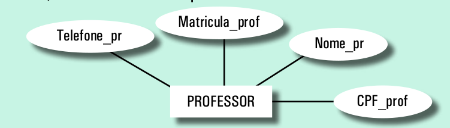
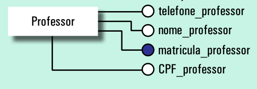
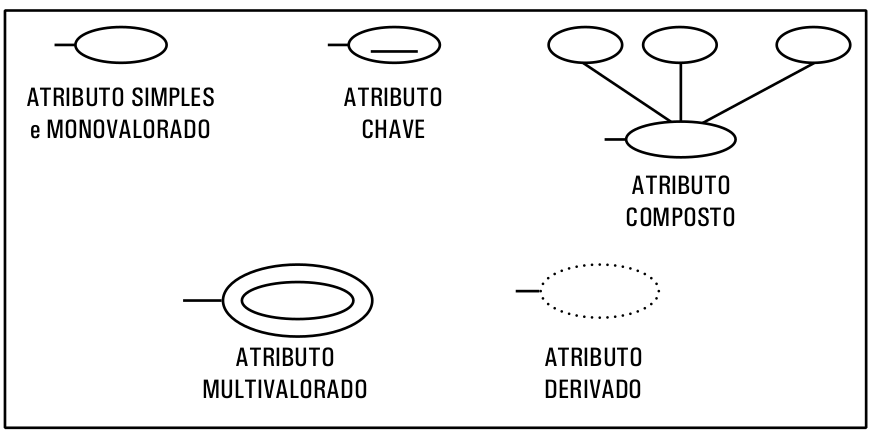

# Modelo Conceitual: Diagrama Entidade-Relacionamento

Este modelo tem por objetivo descrever quais dados devem ser armazenados pela aplicação e quais desses dados se relacionam.

A técnica mais difundida de modelagem conceitual é a *abordagem entidade-relacionamento* (ER). Nesta técnica, um modelo conceitual é usualmente representado graficamente através de um diagrama, chamado de  <!-- 
**O Modelo de Entidade e Relacionamento utiliza uma representação gráfica chamada de
--> **Diagrama de Entidade e Relacionamento (DER).**

Um modelo de entidade relacionamento consiste em um conjunto de objetos básicos chamados de **entidades** e de **relacionamentos** entre as entidades.

Vantagens na utilização do DER:

* **Sintaxe Robusta:** o modelo documenta as necessidades de informação de maneira precisa e clara.
* **Comunicação com usuário:** os usuários podem, com pouco esforço, entender o modelo.
* **Facilidade de criação:** os analistas podem criar e manter um modelo facilmente.
* **Integração com várias aplicações:** diversos projetos podem ser inter-relacionados utilizando-se o modelo.
* **Utilização Universal:** o modelo não está vinculado a um banco de dados específico, o que garante sua independência de implementação.

## Entidades

Uma **entidade** representa um conjunto de objetos do mesmo tipo do mundo real e sobre os quais se pretende armazenar dados. Por exemplo, ao desenvolver um Sistema de Informação para uma escola, as possíveis entidades deste sistema serão: **professores**, **alunos**, **disciplinas**, **turmas** e **cursos**.

### Representação Gráfica - Entidades

Uma **entidade** é representada graficamente por um retângulo com o nome da entidade dentro do retângulo

## Atributos

Além de uma **entidade** representar objetos do mundo real, ela também deve possuir  um conjunto de propriedades que a caracterize e a descreva, bem como  aos seus objetos. A esse conjunto de propriedades dá-se o nome de **atributos**. Por exemplo, para a entidade **Professor**, é necessário armazenar dados como: **CPF**, **nome**, **endereço**, **grau de escolaridade**, **número de matrícula** e etc. Esses dados são os **atributos** da entidade **Professor** e são eles que identificam e caracterizam um objeto do tipo professor.

### Representação Gráfica - Atributos

Um atributo pode ser representado graficamente por uma elipse com o nome do atributo dentro da elipse. A elipse é ligada à entidade por uma linha.

Outra forma de representação utilizada por algumas ferramentas é representar o atributo como uma "bolinha" ligada à entidade e com o nome do atributo ao lado.

### Tipos de Atributos

Os atributos podem ainda ser divididos em 6 categorias:

* simples
* compostos
* monovalorados
* mutivalorados
* derivados
* nulo

**Atributo Simples**

É o atributo indivisível, que não pode ou não deve ser decomposto. Por exemplo, **CPF**, **número de matrícula**, **RG**, **preço do produto** e etc.

**Atributo Monovalorado**

É o atributo quer permite apenas o armazenamento de um valor por vez. Por exemplo, o atributo **CPF** é monovalorado porque a possui apenas um número de CPF. Caso o CPF seja alterado ele é substituído pelo novo valor. Assim, uma pessoa **nunca** terá cadastrado mais um CPF no mesmo tempo.

**Atributo nulo**

É o atributo que permite que seja inserido um valor nulo para ele. Valor nulo representa a inexistência de um valor, ou seja, significa que o usuário não precisa cadastrar um valor para o atributo e pode deixá-lo vazio.

**Atributo Composto**

É o atributo que pode ser decomposto em outros atributos simples. Por exemplo, o atributo **endereço** pode ser decomposto em **nome da rua**, **número** e **complemento**

Este tipo de atributo é representado por uma elipse que deriva outras elipses (uma para cada sub-atributo). Para o **atributo endereço** teríamos uma elipse **endereço** derivando 3 outras elipses (**nome da rua**, **número** e **complemento**)

**Atributo Multivalorado**

É o atributo que permite armazenar mais de uma valor ao mesmo tempo no mesmo campo. Por exemplo, o atributo **e-mail** pode ser multivalorado uma vez que uma mesma pessoa possui, normalmente, mais de um endereço de e-mail.

Este tipo de atributo é representado graficamente por duas elipses (uma dentro da outra) circundando o nome do atributo.

**Atributo Derivado**

É o atributo cujo valor para ele deriva de outro(s) atributo(s). Por exemplo suponha que a sua entidade  se chame **Compra** e que ela tenha os seguintes **atributos**: **número de compra**, **data da compra**, **valor da compra**,**percentual de desconto** e **valor da compra com o desconto**. O valor para este último atributo é calculado considerando-se o **valor da compra** e o **percentual de desconto**. Assim, esse atributo é derivado porque seu valor deriva dos valores de outros atributos e é calculado automaticamente pela aplicação ou pelo SGBD.

Este tipo de atributo é representado por uma elipse  pontilhada.

## Atributo Chave/Chave Primária/Identificador

Um conceito importante no Modelo de Entidade Relacionamento é o conceito de **atributo identificador**. 
<!--A **chave primária** (*Primary Key* ou **PK**) é  um atributo da entidade-->
O **atributo identificador** identifica apenas um objeto dessa entidade. Portanto, o valor dentro de um atributo identificador não poderá se repetir e também não poderá receber um valor nulo.

O **atributo-identificador** também é conhecido como **atributo-chave** ou, até mesmo, como **chave primária (*Primary Key* ou PK)**. Nas seções seguintes, usaremos estes termos como sendo sinônimos mas é preciso compreender que o conceito de **chave primária** é mais adequado de ser utilizado quando estamos trabalhando com modelagem lógica (2ª etapa do projeto de um BD) e não durante o desenvolvimento do modelo conceitual e, mais especificamente, construindo o diagrama ER (1ª etapa).

<!--
>> **identificador: ** conjunto de atributos e relacionamentos cujos valores distinguem uma ocorrência da entidade das demais
-->

Por exemplo, na entidade **Professor**, tanto o atributo **CPF** quanto o atributo **matrícula** não se repetem, uma vez que esses atributos são únicos para cada indivíduo. Nesse caso, qualquer um dos dois atributos poderia ser definido como uma chave primária/atributo chave/identificador.

Um ponto importante a considerar durante a decisão de qual atributo deverá ser o atributo chave é que se deve dar preferência a atributos numéricos (inteiros) em vez de atributos do tipo caracter, data ou hora. 

No DER **devemos grifar o nome do atributo** que definimos como chave primária ou que compõe a chave primária composta.

Obs: No caso da representação de atributos por "bolinhas", as chaves primárias devem ter suas "bolinhas" pintadas de preto.

### Tipos de Atributo-Chave/Chave Primária/Identificadores

Uma **chave** **primária** pode ser **simples** ou **composta**.

Uma **chave** **primária** **simples** é aquela que será **formada por apenas um atributo**.

Uma **chave** **primária** **composto** é **formada por dois ou mais atributos**. Por exempĺo, imagine que tenhamos uma entidade chamada **Localização** e esta entidade tem os seguintes atributos: **nome da cidade**, **nome do estado** e **nome do país**. Cada um desses atributos sozinhos não pode ser chave primária porque eles se repetem.

|**nome_cidade**|**nome_estado**   |**nome_país**|
|---------------|------------------|------|
|Curitiba       |Paraná            |Brasil|
|Maringá        |Paraná            |Brasil|
|Campo Grande   |Mato Grosso do Sul|Brasil|
|Campo Grande   |Rio de Janeiro    |Brasil|

Como os atributos individualmente podem ser repetir, vamos tentar uma chave primária composta. Sabemos que no Brasil um estado não tem duas cidades como o mesmo nome.Sendo assim, poderíamos criar uma chave primária composta do **nome da cidade** mais o **nome do estado**, porque o valor para esses dois atributos juntos nunca vai se repetir. Nesse caso, o atributo **nome da cidade** não é uma chave primária, e sim **faz parte** da chave primária.

## Resumo - Representação Gráfica - Atributos

## Conteúdo complementar

[Slides](https://github.com/IgorAvilaPereira/bd2022_1sem/raw/main/2introducao-er.pdf)
