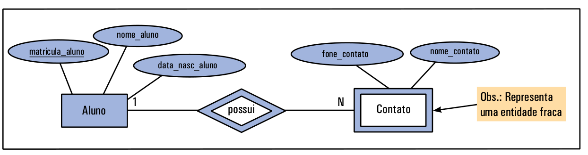
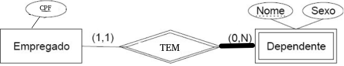

# Entidade Fraca

Entidade Fraca é um tipo de entidade que não possui atributo chave por si só. Isso significa que não é possível definir uma chave, nem simples e nem composta, para a entidade.

Além disso, uma entidade fraca é dependente de uma outra entidade, e o relacionamento entre a entidade fraca e a outra entidade é normalmente 1:N, e o N fica junto à entidade fraca.

A entidade **Contato** da figura é uma entidade fraca porque não possui um atributo (ou conjunto de atributos) que identifique um único objeto. Assim, ela é dependente da entidade **Aluno**, porque só existe um contato se houver o aluno para aquele contato. Finalmente, o relacionamento entre as duas entidades (**Aluno** e **Contato**) é 1:N, ou seja, um aluno pode ter vários contatos, mas um contato pertence a apenas um aluno.

<!--
Livros de banco de dados, geralmente, representam a entidade fraca por um retângulo duplo e o relacionamento entre a entidade fraca e a outra entidade por losango duplo.
-->

**Entidades fracas são representadas por meio de retângulos com bordas duplas**. Os **relacionamentos envolvendo entidades fracas são representados por meio de losangos com bordas duplas**. Normalmente, **chaves parciais são sublinhadas com linhas pontilhadas**.

<!--
Os tipos de entidades que não possuem atributos-chaves são denominados de fracas, diferente dos tipos de entidades que possuem (ao menos um) atributo-chave, denominadas entidades fortes (ou regulares).

Um tipo de entidade fraca sempre atende a restrição de participação total no seu relacionamento com o tipo de entidade identificante. Isso porque uma entidade fraca não pode ser identificada unicamente sem uma entidade forte correspondente.
-->

Uma de entidade fraca tem, normalmente, uma **chave parcial**. Ela corresponde ao conjunto de atributos que pode identificar unicamente as entidades fracas relacionadas à mesma entidade forte proprietária. Abaixo apresentamos um ER com uma entidade fraca que contém uma chave parcial (atributo **Nome**). As chaves parciais são representadas graficamente por sublinhado pontilhado. Neste exemplo é possível identificar um **Dependente** a partir da combinação da chave parcial da própria Entidade **Dependente** (**Nome**) com o **atributo chave da Entidade forte relacionada**, ou seja, observando o **atributo chave** do **Empregado** (**Cpf**) jutamente com a chave parcial de **Dependente** é possível identificar um Dependente único.

Se um **Empregado** é excluído:

* Excluem-se todos os **dependentes**

Perceba na tabela abaixo que tanto o empregado com CPF:**000.000.000-00** como o empregado com CPF:**111.111.111-11** possuem 2 filhos (sendo **João** um nome em comum, ou seja, tanto **000.000.000-00** com **111.111.111-11** possuem um filho **João** ). Entretanto, mediante a combinação de valores da **chave forte** de **Empregado** com a **chave parcial** da entidade fraca **Dependente** é possível identificar com clareza qual **João** é filho do **Empregado** com CPF:**000.000.000-00** e qual **João** é filho do empregado com CPF:**111.111.111-11**.

|**cpf_empregado**|**nome_dependente** |
|---------------|------------------|
|000.000.000-00       |Pedro            |
|**000.000.000-00**        |**João**            |
|111.111.111-11   |Fernando|
|**111.111.111-11**   |**João**    |

