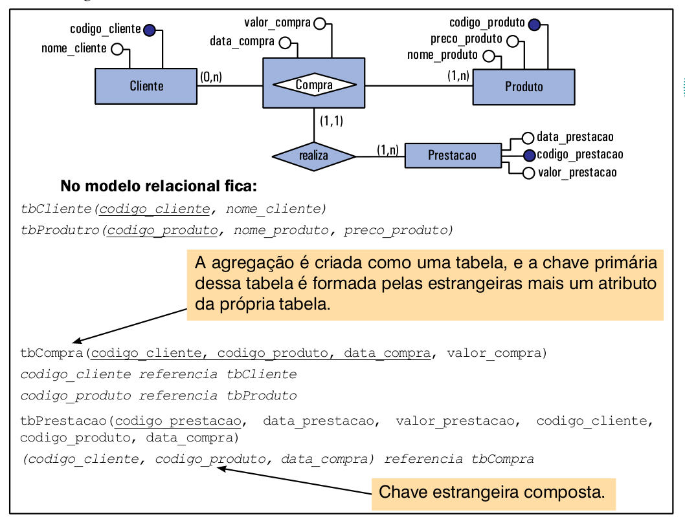

# Conversão entre o Modelo ER e o Modelo Relacional

O modelo relacional é definido usando como base o modelo ER. Lembre-se de que o modelo relacional consiste em uma coleção de **tabelas** e na definição de **chaves estrangeiras** para relacionar essas tabelas. Sendo assim, construir o modelo relacional consiste em definir as **tabelas** e as **chaves estrangeiras**.

Existem algumas regrinhas que devem ser aplicadas para fazer a conversão de um modelo no outro. Vamos entender cada uma dessas regras.

## Entidade

Toda **entidade** do modelo ER vira uma **tabela** no modelo relacional. Essa tabela terá a mesma chave primária (identificador) e os mesmos atributos definidos na entidade.

Caso a entidade tenha **atributos compostos**, eles devem ser decompostos (se ainda não foram).
Por outro lado, uma boa prática seria separar os **atributos compostos** em novas tabelas. No exemplo, o **atributo composto** **endereço** poderia seria uma nova tabela com seus sub-atributos convertidos em colunas desta nova tabela. Além disso, haveria ainda a necessidade de uma chave estrangeira **FK** que referenciasse a chave primária de **Professor**. Esta **FK** seria, simultaneamente, chave estrangeira e chave primária da tabela de **endereço**.

Caso a entidade tenha atributos multivalorados, para cada atributo multivalorado cria-se uma nova tabela. A tabela correspondente ao atributo multivalorado vai ter como atributos o atributo multivalorado em sim + a chave primária da tabela onde o atributo multivalorado estava inserido (que vai passar como chave estrangeira para a nova tabela). As figuras abaixo apresentam um exemplo desta situação.

## Entidade Fraca

Para cada entidade fraca do ER, é criada uma tabela no modelo relacional, incluindo todos os atributos da entidade fraca, mais a chave primária da entidade com a  qual a entidade fraca se relaciona (que passa como uma chave estrangeira). A chave primária desta nova tabela será composta por um ou mais atributos da entidade fraca mais a chave estrangeira.

## Relacionamento N para N

**Todo relacionamento com cardinalidade - Muitos para Muitos - entre duas entidades, vira uma nova tabela**. Essa nova tabela irá conter todos os atributos do relacionamento (se houver) mais as chaves primárias das entidades que fazem parte desse relacionamento. As chaves primárias que vão passar para a nova tabela como chaves estrangeiras. A **chave primária** da nova tabela será composta pelas **chaves estrangeiras** e, se houver necessidade, por algum **atributo descritivo** (atributo pertencente ao relacionamento do ER).

## Relacionamento 1 para N

Relacionamentos com cardinalidade 1:N não geram nova tabela. No entanto, para que se possa manter o relacionamento cria-se uma chave estrangeira na entidade que possui a cardinalidade N. Se o relacionamento tiver atributos descritivos, esses atributos irão "seguir" a chave estrangeira, ou seja, ficarão na mesma tabela que a chave estrangeira ficar (a da cardinalidade N).

## Relacionamento 1 para 1

Relacionamentos com cardinalidade 1:1 entre duas entidades não geram uma nova tabela. No entanto, deve-se escolher a chave primária de uma das entidades ligadas ao relacionamento e inseri-la como chave estrangeira na outra tabela.

A questão aqui é a seguinte: Qual tabela deve receber a chave estrangeira já que a cardinalidade máxima das duas entidades é 1? Para que possamos decidir quem recebe a chave estrangeira, é necessário considerar o tipo de participação das entidades do relacionamento. O tipo de participação pode ser **total** ou **parcial**.

A **participação total** ocorre quando todos os objetos de uma entidade participam do relacionamento e a **participação parcial** ocorre quando apenas alguns objetos da entidade participam do relacionamento.

Por exemplo (figura abaixo), suponha que tenhamos as **entidades** *Escola* e *Professor*, nas quais se percebe que uma escola sempre tem um professor que é diretor, mas nem todo professor é um diretor. Neste tipo de relacionamento, a entidade *Escola* tem **participação total**, uma vez que **toda** escola terá um diretor. A entidade *Professor* tem **participação parcial**, uma vez que nem todo professor é diretor. Sendo assim, a entidade que participação total *Escola* é que deve receber a chave estrangeira.

Note que a escolha pela entidade que tem participação total é feita para evitarmos valores nulos na tabela. Uma vez que toda escola tem um diretor, não teremos valor nulo para a chave estrangeira.

No caso das duas entidades terem **participalçao total**, fica a critério do desenvolvedor escolher quem receberá a chave estrangeira.

Se as duas entidades tiverem **participação parcial**, também é o desenvolvedor quem decide para onde vai a chave estrangeira, devendo ele fazer uma análise de qual tabela que receberia menos valores nulos e adicionando a chave estrangeira nessa tabela.

Se o relacionamento tiver atributos descritivos, os atributos "seguem" a chave estrangeira, ou seja, os atributos descritivos ficarão na mesma tabela que a chave estrangeira.

## Relacionamento Recursivo

Todo relacionamento recursivo gera uma chave estrangeira que faz referência à chave primária da própria tabela, conforme figura abaixo.

Observe que na descrição do modelo relacional foi adicionado o atributo **matricula_aluno_representante** para especificar o relacionamento recursivo. Este atributo é uma chave estrangeira que faz referência ao atributo **matricula_aluno** da prória tabela **tbAluno**.

## Relacionamentos Ternários ou Maiores

Para cada relacionamento entre mais de duas entidades, cria-se uma tabela contendo todos atributos descritivos do relacionamento (se houver) + as chaves primárias de todas entidades ligadas ao relacionamento (que passam como chaves estrangeiras).

A chave primária da nova tabela, será composta pelos atributos chaves das entidades participantes do relacionamento que tiverem cardinalidade N e, se houver necessidade, mais algum atributo descritivo. As figuras abaixo ilustram um exemplo de conversão de um relacionamento ternário (vindo do diagrama ER) para o modelo relacional.

## Agregação

Uma agregação no modelo ER vira uma tabela no modelo relacional e irá conter seus próprios atributos, mas as chaves estrangeiras de acordo com os seus relacionamentos, como mostra a figura abaixo.

Observe que a tabela **tbPrestacao** possui uma chave estrangeira composta. Essa chave estrangeira é composta porque a sua primária correspondente também é composta.

Quanto temos uma chave primária composta, não podemos passar para outra tabela apenas parte da chave, e por esse motivo sua estrangeira correspondente também será composta.