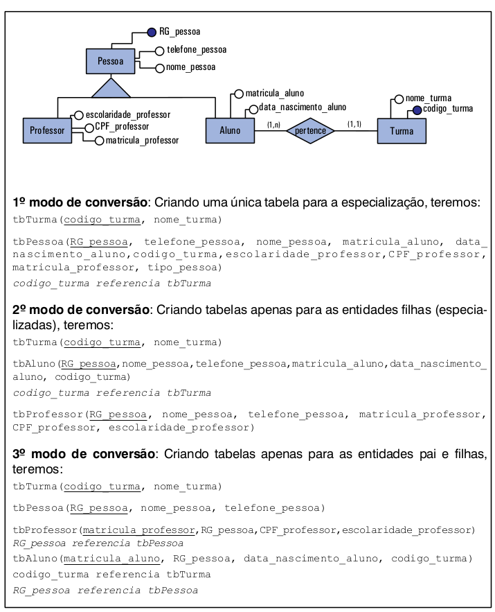

# Modelo Relacional - Tópicos Avançados

## Herança/Especialização 

A transformação de uma especialização do modelo ER para o modelo relacional pode ser feita de 3 diferentes modos:

1. Criando uma tabela apenas para a entidade pai;
2. Criando uma tabela apenas para as entidades filhas;
3. Criando uma tabela para cada entidade (tanto para a entidade pai, quanto para as filhas).

Na primeira situação, será criada uma única tabela com o nome da entidade pai e essa irá conter: todos os atributos da entidade pai (genérica), os atributos da(s) entidade(s) filha(s) (entidades especializadas), atributos referentes a possíveis relacionamentos e um atributo chamado **"tipo"** que identificará qual entidade especializada está sendo representada em uma linha. A chave primária dessa tabela será a própria chave primária da entidade pai.

Na segunda situação, serão criadas tabelas apenas para as entidades filhas. Cada entidade filha que virar uma tabela terá como atributos tantos os seus atributos específicos e de seus relacionamentos diretos, quanto os atributos da entidade pai, mais os atributos dos relacionamentos de outras entidades com a entidade pai. A chave primária de cada uma das tabelas especializadas será a chave primária da entidade pai. As tabelas criadas serão completamente independentes umas das outras.

Na terceira situação, serão criadas tabelas para todas as entidades (pai e filhas). Cada tabela terá seus atributos específicos, e os atributos dos seus relacionamentos. As tabelas referentes às entidades filhas também receberão como chave estrangeira a chave primária da entidade pai. A chave primária para entidade filha será a chave estrangeira, que neste caso terá as duas funções (**PK** e **FK**). Caso exista algum atributo que identifique unicamente a entidade filha, ele poderá ser escolhido como chave primária e a chave primária da entidade pai passa apenas como chave estrangeira, como mostra a figura abaixo.

A pergunta que aparece nesse momento é a seguinte: **Qual abordagem eu devo utilizar quando o modelo apresenta uma especialização?**

A primeira abordagem irá conter muitos valores nulos, uma vez que dado o tipo do objeto somente os atributos referentes àquele objeto serão preenchidos. Por isso, nem todos os atributos serão obrigatórios. Por outro lado, essa primeira abordagem tem a vantagem de dispensar a necessidade de junção entre tabelas, uma vez que todos os dados estão na mesma tabela.

A segunda abordagem é pouco recomendada, porque pode gerar redundância de dados, uma vez que os dados da entidade genérica são repetidos em todas as tabelas especializadas. Assim, se uma pessoa for tanto professor como aluno, teremos informações referentes a essa pessoa repetida nas duas tabelas. Portanto, essa abordagem só deve ser utilizada quando tivermos **uma especialização exclusiva (ou total)**, ou seja, uma pessoa ou é do tipo aluno ou do tipo professor.

A terceira abordagem tem a vantagem de evitar os valores nulos que aparecem na primeira abordagem e ainda a de não permitir a duplicidade como na segunda abordagem. Entretanto, para pesquisar todas as informações de um registro pertencente, originalmente, a uma entidade filha do ER é preciso fazer uma consulta de junção entre a tabela pai e a tabela filha correspondente.

Assim, o desenvolvedor da base de dados deve analisar todos os aspectos referentes à situação que se está modelando e optar pela solução que seja mais adequada ao problema.
