Desenvolva o Diagrama Entidade-Relacionamento para as seguintes situações:

Um aluno realiza vários trabalhos. Um trabalho é
realizado por um ou mais alunos.

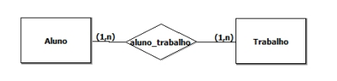

Um diretor dirige no máximo um departamento. Um
departamento tem no máximo um diretor.

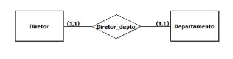

Um autor escreve vários livros. Um livro pode ser
escrito por vários autores.

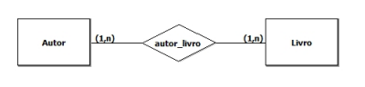

Uma equipe é composta por vários jogadores. Um
jogador joga apenas em uma equipe.

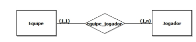

Um cliente realiza várias encomendas. Uma
encomenda diz respeito apenas a um cliente.

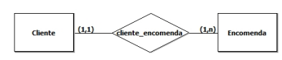

Um berçário deseja informatizar suas operações.
Quando um bebê nasce, algumas informações
são armazenadas sobre ele, tais como: nome,
data do nascimento, peso do nascimento, altura,
a mãe deste bebê e o médico que fez seu parto.
Para as mães, o berçário também deseja manter
um controle, guardando informações como:
nome, endereço, telefone e data de nascimento.
Para os médicos, é importante saber: CRM,
nome, telefone celular e especialidade.

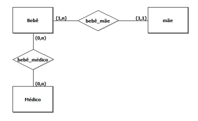

Uma floricultura deseja informatizar suas
operações. Inicialmente, deseja manter um
cadastro de todos os seus clientes, mantendo
informações como: RG, nome, telefone e
endereço. Deseja também manter um cadastro
contendo informações sobre os produtos que
vende, tais como: nome do produto, tipo (flor,
vaso, planta,...), preço e quantidade em estoque.
Quando um cliente faz uma compra, a mesma é
armazenada, mantendo informação sobre o
cliente que fez a compra, a data da compra, o
valor total e os produtos comprados.

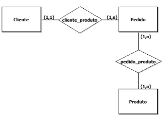

Uma Escola tem várias turmas. Uma turma
tem vários professores, sendo que um
professor pode ministrar aulas em mais de
uma turma. Uma turma tem sempre aulas na
mesma sala, mas uma sala pode estar
associada a várias turmas (com horários
diferentes).

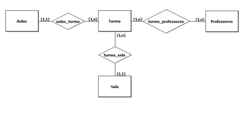

Uma biblioteca deseja manter informações sobre
seus livros. Inicialmente, quer armazenar para os
livros as seguintes características: ISBN, título, ano
editora e autores deste livro. Para os autores,
deseja manter: nome e nacionalidade. Cabe
salientar que um autor pode ter vários livros, assim
como um livro pode ser escrito por vários autores.
Cada livro da biblioteca pertence a uma categoria. A
biblioteca deseja manter um cadastro de todas as
categorias existentes, com informações como:
código da categoria e descrição. Uma categoria
pode ter vários livros associados a ela.

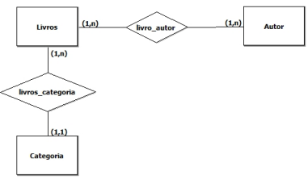

Uma firma vende produtos de limpeza, e deseja melhor
controlar os produtos que vende, seus clientes e os
pedidos. Cada produto é caracterizado por um código,
nome do produto, categoria (ex. detergente, sabão em pó,
sabonete, etc), e seu preço. A categoria é uma
classificação criada pela própria firma. A firma possui
informações sobre todos seus clientes. Cada cliente é
identificado por um código, nome, endereço, telefone,
status ("bom", "médio", "ruim"), e o seu limite de crédito.
Guarda-se igualmente a informação dos pedidos feitos
pelos clientes. Cada pedido possui um número e guarda-se
a data de elaboração do pedido. Cada pedido pode
envolver de um a vários produtos, e para cada produto,
indica-se a quantidade deste pedida.

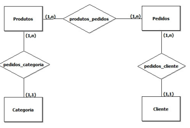

Considere o banco de dados de uma livraria. De acordo com os requisitos a seguir, construa um DER para
representar o banco de dados desta livraria.
1. A livraria deseja manter um cadastro de clientes.
2. Sobre cada cliente, é importante manter seu endereço, telefone, CPF e lista dos livros que este
cliente já comprou. Para cada compra, é importante guardar a data em que esta foi realizada.
3. Um cliente pode comprar muitos livros. Um livro pode ser vendido para mais de um cliente pois
geralmente há vários livros em estoque.
4. Um cliente pode ser pessoa física ou jurídica. Se for pessoa jurídica, o seu identificador deve ser
o CNPJ.
5. A livraria compra livros livros de editoras.
6. Sobre as editoras, a livraria precisa de seu código, endereço, telefone de contato, e o nome de seu
gerente.
7. Cada cliente tem um código único.
8. Deve-se manter um cadastro sobre cada livro na livraria. Para cada livro, é importante armazenar
o nome do autor, assunto, editora, ISBN e a quantidade dos livros em estoque.
9. Editoras diferentes não fornecem o mesmo tipo de livro.

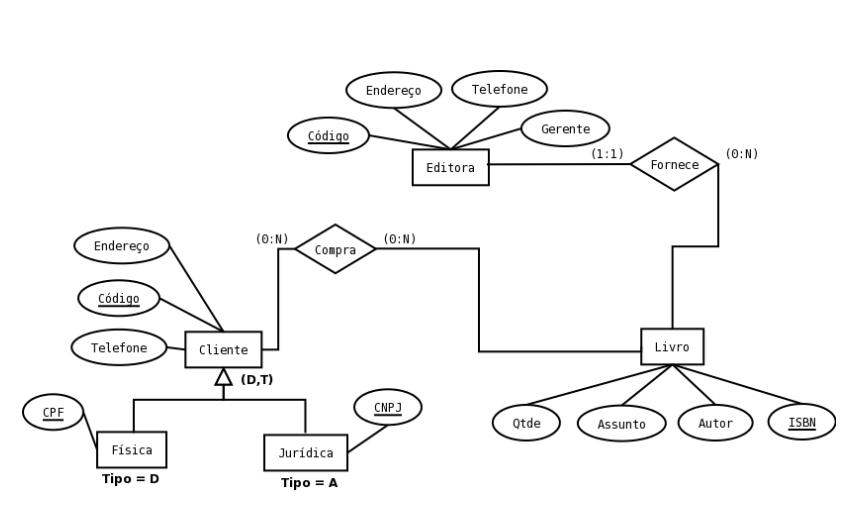

Considere o banco de dados de um hospital. De acordo com os requisitos a seguir, construa um DER para representar o banco de dados.
1. O hospital possui várias alas.
2. Cada ala possui uma enfermeira responsável.
3. Cada enfermeira se reporta a uma enfermeira-chefe.
4. Enfermeiras podem atender apenas uma ala.
5. O hospital atende (credencia) os planos de saúde A, B e C.
6. Para cada plano de saúde, é necessário saber os médicos credenciados no mesmo.
7. Médico tem CRM e enfermeira CRE que lhes são únicos.
8. Todo atendimento de um médico a um paciente deve ser registrado com a data e hora em que o
mesmo ocorreu.
9. Um mesmo paciente pode ser atendido por mais de um médico.
10. Hospital tem CNPJ.
11. Ala do hospital tem um identificador.
12. Plano de saúde tem um nome e telefone da operadora.
13. Médicos tem nome e especialidade.
14. Enfermeiras tem nome.
15. O nome de um plano de saúde é único.

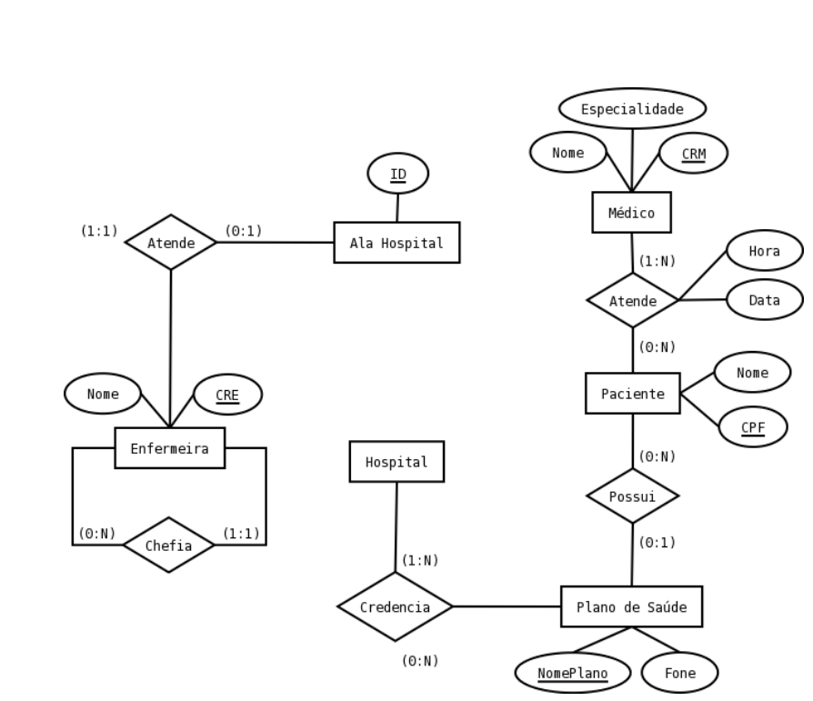

Deseja-se projetar a base de dados de um sistema de controle de freqüência de empregados de uma
organização. Através de um diagrama entidade-relacionamento, deve ser modelada esta base de dados. A base de dados não deve conter redundância de dados. O modelo ER deve ser representado
com a notação vista em aula ou com outra notação de poder de expressão equivalente. O modelo
deve apresentar, ao menos, entidades, relacionamentos, atributos, especializações, identificadores e
restrições de cardinalidade. Não criar identificadores artificiais. Não usar atributos multi-valorados.
O modelo deve ser feito no nível conceitual, sem incluir chaves estrangeiras.
A base de dados deve manter dados sobre empregados. Cada empregado é identificado por um
código e tem um nome. Para fins de controle de freqüência, há dois tipos de empregados.
Um tipo de empregado é o que tem horário livre. Empregados deste tipo podem trabalhar em
qualquer horário do dia. Para estes empregados basta saber quantas horas devem trabalhar ao longo
do mês, bem como, qual é o menor período em horas que devem trabalhar. Exemplificando, há alguns
empregados que não devem trabalhar menos que duas horas cada vez.
Empregados de segundo tipo devem trabalhar em horários fixos. A semana de trabalho do empregado deste tipo está organizada em turnos. Um turno (1) inicia em um dia da semana e um horário e
(2) termina em um dia da semana (possivelmente diferente do de início) e em um horário. O empregado pode trabalhar dois turnos no mesmo dia da semana. Cada dia da semana é identificado por um
código (algo como "d", "s", . . . ) e tem um nome (algo como "domingo", "segunda-feira", . . . ).

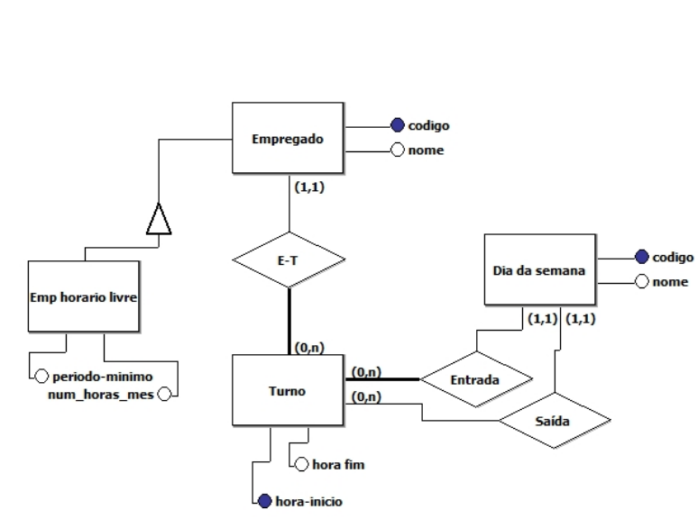

<!--
Uma companhia musical decidiu criar uma base de dados com informação sobre os seus músicos bem como demais informações da companhia. Desenhe o diagrama de entidades e relacionamentos para este problema de acordo com as seguintes informações:

Cada músico tem um nro. de BI, um nome, uma morada e um número de telefone. Os músicos em início de carreira muitas vezes partilham um endereço e além disso assume-se que cada endereço só tem um telefone.
Cada instrumento usado nos estúdios tem um nome (ex. guitarra, bateria, etc.) e um código interno.
Cada disco gravado na companhia tem um título, uma data, um formato (ex. CD, MC, K7), e um identificador do disco.
Cada música gravada na companhia tem um título e um autor.
Cada músico pode tocar vários instrumentos, e cada instrumento pode ser tocado por vários músicos.
Cada disco tem um certo número de músicas, mas cada música só pode aparecer num disco.
Cada música pode ter a participação de vários músicos, e cada músico pode participar em várias músicas.
Cada disco tem um músico que é o seu produtor. Os músicos podem produzir vários discos.
-->

 